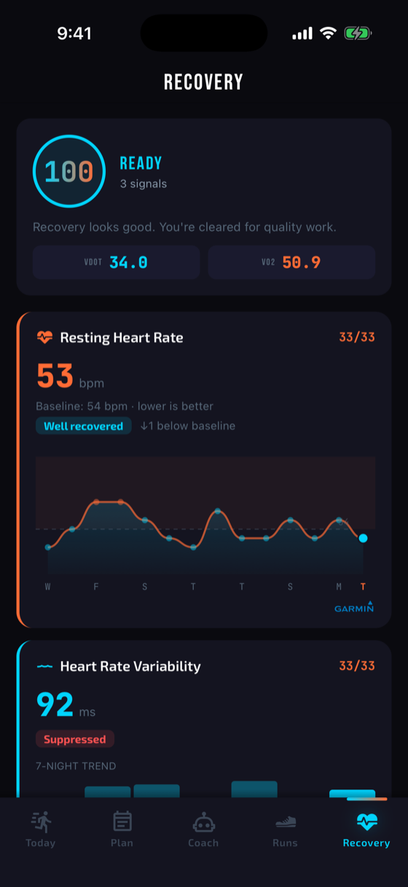
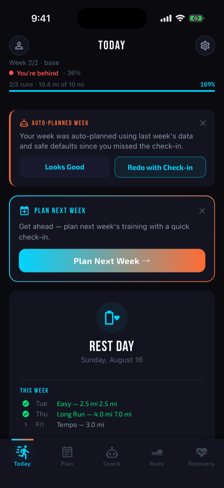
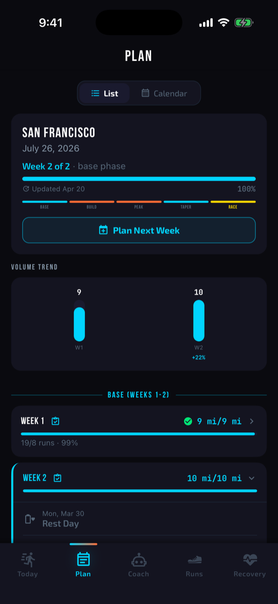
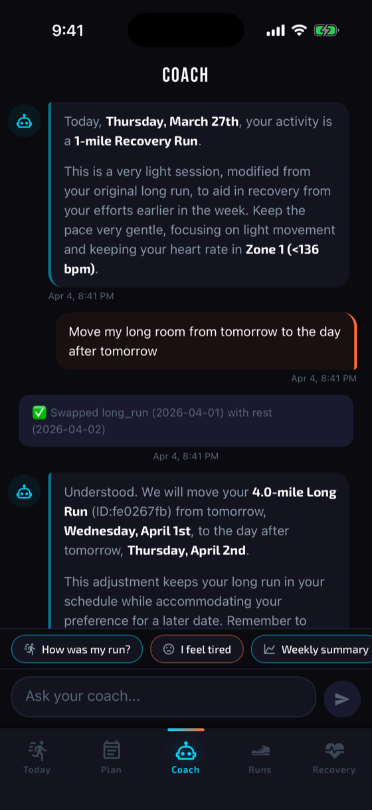
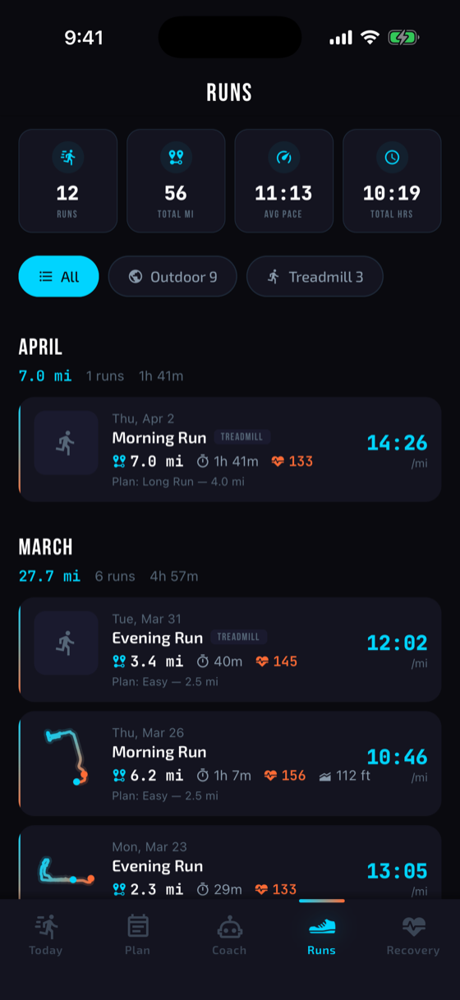

<p align="center">
  
</p>

<p align="center">
  <a href="https://www.everlift.fit"></a>
  <a href="https://apps.apple.com/us/app/everlift-gym-workout-log/id6760033237"></a>
  <a href="https://play.google.com/store/apps/details?id=com.everlift.app"></a>
  <a href="https://github.com/cDilash/Gati"></a>
</p>

<table>
<tr>
<td width="62%" valign="top">

### 01 / FLAGSHIP PRODUCT

## [Everlift — Workout · Log · Ascend](https://github.com/cDilash/everlift-showcase)

A local-first workout tracker built for **fast mid-set logging, honest training math, recovery intelligence, and deep progress analytics**.

`LIVE ON IOS & ANDROID` · `9 LANGUAGES` · `400+ EXERCISES` · `NO ADS`

**Why it matters:** Everlift is not a concept or tutorial project. It is a product I designed, engineered, localized, and shipped to both major app stores.

[App Store](https://apps.apple.com/us/app/everlift-gym-workout-log/id6760033237) · [Google Play](https://play.google.com/store/apps/details?id=com.everlift.app) · [Product site](https://www.everlift.fit) · [Engineering case study](https://github.com/cDilash/everlift-showcase)

</td>
<td width="38%" align="center" valign="middle">
  <a href="https://github.com/cDilash/everlift-showcase">
    
  </a>
</td>
</tr>
</table>

<table>
<tr>
<td width="38%" align="center" valign="middle">
  <a href="https://github.com/cDilash/Gati">
    
  </a>
</td>
<td width="62%" valign="top">

### 02 / SECOND PRODUCT

## [Gati — Adaptive Marathon Coaching](https://github.com/cDilash/Gati)

An AI-first marathon coach that plans **one week at a time** from real check-in data, connected run history, and overnight recovery signals.

`GEMINI PLANNING` · `STRAVA + GARMIN` · `LOCAL-FIRST` · `IN DAILY USE`

**Why it matters:** Everlift is the proof I can ship. Gati is where I push on applied intelligence — a model proposes each training week, and a deterministic safety layer clamps anything that would ramp volume too fast. The AI advises; the math decides.

[Repository](https://github.com/cDilash/Gati) · [Architecture](https://github.com/cDilash/Gati#architecture)

</td>
</tr>
</table>

<table>
<tr>
<td width="25%" align="center" valign="top">
  
  <br /><sub><b>TODAY</b><br />Session, briefing, week progress</sub>
</td>
<td width="25%" align="center" valign="top">
  
  <br /><sub><b>PLAN</b><br />Phases, volume trend, week detail</sub>
</td>
<td width="25%" align="center" valign="top">
  
  <br /><sub><b>COACH</b><br />Chat that edits the plan</sub>
</td>
<td width="25%" align="center" valign="top">
  
  <br /><sub><b>RUNS</b><br />Connected history vs. plan</sub>
</td>
</tr>
</table>

<p align="center">
  
</p>

## 03 / SYSTEMS I LIKE TO BUILD

<table>
<tr>
<td width="33%" valign="top">

### ◉ Mobile products

Interfaces designed for real-world use: fast paths, native capabilities, offline resilience, and details that survive production.

`REACT NATIVE` `EXPO` `SWIFTUI`

</td>
<td width="33%" valign="top">

### ◈ Applied intelligence

AI that supports a clear job instead of becoming the product story: coaching, transcription, useful automation, and contextual decisions.

`GEMINI` `WHISPER` `PYTHON`

</td>
<td width="33%" valign="top">

### ◎ Local-first data

Software that stays responsive and trustworthy when the network disappears, with deliberate synchronization and privacy boundaries.

`SQLITE` `DRIZZLE` `SUPABASE`

</td>
</tr>
</table>

## 04 / SELECTED SYSTEMS

<table>
<tr>
<td width="25%" valign="top">

### [Everlift](https://github.com/cDilash/everlift-showcase)

Shipped workout intelligence for iOS and Android.

`MOBILE` `DATA`

</td>
<td width="25%" valign="top">

### [Gati](https://github.com/cDilash/Gati)

Adaptive marathon coaching with connected run data.

`AI` `MOBILE`

</td>
<td width="25%" valign="top">

### [Echofy](https://github.com/cDilash/Echofy)

Private, on-device transcription powered by Whisper.

`AI` `PRIVACY`

</td>
<td width="25%" valign="top">

### [Load Balancer](https://github.com/cDilash/Load-Balancer-Game-Server)

Thread-safe game-server simulation and metrics.

`PYTHON` `SYSTEMS`

</td>
</tr>
</table>

## 05 / OPERATING PRINCIPLES

```text
01  SHIP THE SMALLEST COMPLETE EXPERIENCE
02  MAKE THE FAST PATH FEEL INSTANT
03  KEEP USER DATA BORINGLY SAFE
04  USE AI WHERE CONTEXT CREATES LEVERAGE
05  POLISH IS FUNCTIONAL WHEN PEOPLE USE IT DAILY
```

<p align="center">
  <a href="https://www.everlift.fit">everlift.fit</a>
  &nbsp;·&nbsp;
  <a href="https://github.com/cDilash/everlift-showcase">flagship case study</a>
  &nbsp;·&nbsp;
  <a href="https://github.com/cDilash?tab=repositories">all public work</a>
</p>
