  

## About

I’m an independent product engineer building practical software across mobile, AI, data, and the web. My flagship product is **Everlift**, a local-first workout tracker live on iOS and Android.

## Featured product

<table>
<tr>
<td width="62%" valign="top">
<h3><a href="https://github.com/cDilash/everlift-showcase">Everlift — Workout · Log · Ascend</a></h3>

A fast, privacy-conscious workout tracker with one-tap logging, honest training math, recovery intelligence, and deep progress analytics.

<strong>Live on iOS & Android</strong> · 9 languages · 400+ exercises · Offline-first

<a href="https://apps.apple.com/us/app/everlift-gym-workout-log/id6760033237">App Store</a> ·
<a href="https://play.google.com/store/apps/details?id=com.everlift.app">Google Play</a> ·
<a href="https://www.everlift.fit">Website</a> ·
<a href="https://github.com/cDilash/everlift-showcase">Case study</a>

</td>
<td width="38%" align="center">

</td>
</tr>
</table>

## Selected work

| Project | What it does | Stack |
| --- | --- | --- |
| [Everlift](https://github.com/cDilash/everlift-showcase) | Live workout tracker with recovery intelligence, accurate training analytics, and an offline-first experience. | React Native · Expo · TypeScript · SQLite · Supabase |
| [Gati](https://github.com/cDilash/Gati) | AI-assisted marathon coaching with adaptive plans, run-data integrations, and local-first storage. | React Native · Expo · TypeScript · Gemini · SQLite · Supabase |
| [Echofy](https://github.com/cDilash/Echofy) | Privacy-first local transcription workstation powered by Whisper. | Python · Flask · Whisper · PyTorch |
| [Game Server Load Balancer](https://github.com/cDilash/Load-Balancer-Game-Server) | Round-robin game-server simulation with thread-safe metrics and performance visualizations. | Python · Matplotlib |

## Tools

`TypeScript` · `React Native` · `Expo` · `Python` · `Supabase` · `SQLite` · `Drizzle ORM`
